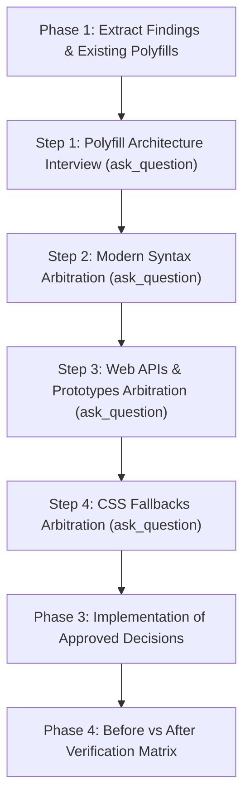

# Senior Compatibility Optimizer (`compat-optimize`)

Diagnose and remediate browser compatibility gaps identified by `compat-audit` with the rigor of a Senior Web Platform Engineer: verify root causes, separate application code from third-party vendor leaks, reject naive fake polyfills, and **actively arbitrate every architectural choice with the developer using interactive decision prompts (`ask_question`) in a structured grill-me workflow**.

---

## Cardinal Rule: Mandatory Interactive Grill-Me Interview

> **CRITICAL DIRECTIVE**: You are an active decision partner, NOT a passive report generator.
> - **NEVER** dump a static analysis report and wait for text feedback.
> - **NEVER** apply mass code modifications or create files without prior interactive confirmation.
> - **YOU MUST** actively interview the developer step-by-step using `ask_question` modals for each category of findings before implementing solutions.

---

## 4-Step Interactive Optimization Workflow



---

### Phase 1: Context & False-Positive Inspection

1. **Extract Findings**:
   Retrieve compatibility issues from recent conversation or run:
   ```bash
   npx compat-audit --build --json
   ```
2. **Inspect Detected Polyfills**:
   Inspect `detectedPolyfills` reported by `compat-audit` (verified via runtime VM sandbox on compiled bundle chunks).
3. **Anti-False-Positive Check**:
   - Verify if flagged prototype methods (`.at()`, `.toSorted()`) are invoked on standard built-in types vs custom domain models.
   - Check if source maps link flagged issues to third-party dependencies (`node_modules/`) or application code (`src/`).

---

### Phase 2: Interactive Decision Grill (Using `ask_question`)

Execute sequential interviews with the developer using `ask_question` for each detected category:

#### Interview Step 1: Polyfill Architecture Alignment
Before generating any shims, prompt the developer:
- **Question**: *"How should runtime polyfills be structured in this project?"*
- **Options**:
  - `(Recommended) Use/update dedicated project polyfills file (e.g. apps/web/src/polyfills.ts or src/polyfills.ts) loaded at entry point`
  - `Generate a new lightweight src/polyfills.ts and wire it to main entry point`
  - `Avoid runtime shims: rely strictly on bundler downleveling and build-time transforms`

#### Interview Step 2: Modern Syntax Arbitration (BLOCKING - `SyntaxError`)
*Trigger if issues contain modern JS operators or syntax (e.g. `?.`, `??`, `??=`, `#privateField`, `static blocks`).*
- **Question**: *"How would you like to handle modern JS syntax ({feature}) found in {file/origin}?"*
- **Options**:
  - `(Recommended) Downlevel bundler build target in vite.config / tsconfig (e.g. target: 'es2020')`
  - `Configure bundler transpilation specifically for the offending dependency (optimizeDeps / babel)`
  - `Accept requirement and raise declared browser target in browserslist / package.json`

#### Interview Step 3: Lightweight Prototypes & Built-ins (BLOCKING/HIGH - `TypeError`)
*Trigger for methods like `Array.prototype.toSorted`, `Array.prototype.at`, `Array.prototype.findLast`, `Object.hasOwn`, `Object.fromEntries`, `Uint8Array.fromBase64`.*
- **Question**: *"Which remediation strategy do you prefer for prototype method {feature}?"*
- **Options**:
  - `(Recommended) Add zero-dependency inline shim (< 300 bytes) guarded by if (!...) in polyfills file`
  - `Refactor application source code to use universal ES2015 alternatives (e.g. [...arr].sort() instead of toSorted)`
  - `Install official vetted micro-package`

#### Interview Step 4: Complex Web APIs (HIGH - `ReferenceError`)
*Trigger for complex APIs like `structuredClone`, `ResizeObserver`, `crypto.randomUUID`.*
- **Question**: *"How should we handle the Web API {API} for older browsers?"*
- **Options**:
  - For `structuredClone`:
    - `(Recommended) Install @ungap/structured-clone (1.2KB gzip) for complete spec compliance (Map, Set, circular refs)`
    - `Refactor to JSON.parse(JSON.stringify(data)) if cloning only plain serializable data`
    - `Inject audited lightweight inline deep-clone shim into polyfills file`
  - For `ResizeObserver` / `IntersectionObserver`:
    - `(Recommended) Dynamically import polyfill only on browsers where window observer is missing`
    - `Refactor component to standard window resize or scroll listener`

#### Interview Step 5: CSS Progressive Enhancement (MEDIUM / LOW)
*Trigger for CSS issues (e.g. `100dvh`, `-webkit-` prefixes, `:has()` fallback).*
- **Question**: *"How should CSS compatibility gaps ({feature}) be resolved?"*
- **Options**:
  - `(Recommended) Dual declarations inline (e.g. height: 100vh; height: 100dvh; and -webkit- vendor prefixes)`
  - `Configure PostCSS preset (postcss-preset-env) for automated CSS downleveling`
  - `Leave as progressive enhancement (graceful degradation without fallback)`

---

### Phase 3: Implementation & Entry Wiring

Once the developer makes their selections through `ask_question`:
1. **Apply Polyfills**: Update `src/polyfills.ts` (or `apps/web/src/polyfills.ts`) with strictly guarded shims.
2. **Wire Entry**: Ensure polyfills are imported on line 1 of application entry points (`src/main.ts`, `src/index.ts`, `app/layout.tsx`, `src/routes/+layout.svelte`, etc.).
3. **Update Configs**: Apply bundler target changes to `vite.config.*`, `tsconfig.json`, or PostCSS configs as selected.

---

### Phase 4: Before vs After Verification Matrix

1. **Re-run Audit**: Execute `npx compat-audit --build --json`.
2. **Present Verification Matrix**:

| Metric | Before Optimization | After Optimization | Delta / Status |
| :--- | :--- | :--- | :--- |
| **Target Coverage %** | `88.4%` | `98.6%` | `+10.2%` |
| **Audience Gap %** | `11.6%` | `1.4%` | `-10.2%` (Recovered) |
| **Blocking Issues** | `2` | `0` | `-2` (Resolved) |
| **High Issues** | `1` | `0` | `-1` (Resolved) |
| **Medium / Low Issues** | `3` | `0` | `-3` (Resolved) |
| **Active Polyfills** | `0` | `4` | `+4` (Detected & whitelisted) |
| **Estimated Bundle Impact** | - | `+0.4 KB` | Negligible |

3. **Document Remaining Items**: If any gap remains intentionally, document browser degradation notes.
