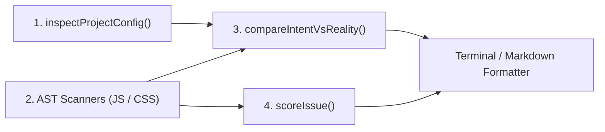

# compat-audit

> Browser compatibility engine and AI agent skill scaffolder for compiled production assets.

[](LICENSE)
[](https://nodejs.org/)
[](https://www.npmjs.com/package/compat-audit)

---

## Overview

Static linters analyze raw source code, missing runtime realities:
- Modern bundlers transpile syntax (classes, arrow functions) but do not polyfill runtime global APIs (`structuredClone`, `Array.prototype.at`, `crypto.randomUUID`, `ResizeObserver`).
- Third-party packages in `node_modules` inject untranspiled CSS (`&` nesting, `oklch()`, `@container`) and modern syntax leaks directly into production chunks.
- Internal monorepo packages often bypass application-level Babel/Vite downleveling.

`compat-audit` parses the AST of compiled production bundles (`dist/`, `build/`, `.output/`) and evaluates findings against MDN Browser Compatibility Data and Can I Use statistics across both Desktop and Mobile browser engines (Chrome, Safari, Firefox, Edge, iOS Safari, Chrome Android, Samsung Internet). It computes real browser support floors, detects Safari and WebKit visual quirks (viewport jumps, missing prefixes, flexbox blowouts), detects drift against declared targets, and provides deterministic remediation plans.

---

## Quickstart

### 1. Direct CLI Audit

Run directly against your build directory:

```bash
# Auto-detects dist/ and scans bundle
npx compat-audit

# Force a clean build before scanning to ensure fresh assets
npx compat-audit --build --json
```

### 2. Scaffold AI Agent Skills

Integrate native compatibility capabilities into your development workflow across Claude Code, Google Antigravity, OpenAI Codex, Cursor, Windsurf, and GitHub Copilot:

```bash
npx compat-audit --init-skills
```

Select project-level (`.agents/skills/` + bridges) or global machine-level (`~/.agents/skills/`).

---

## How the Engine Works

`compat-audit` is a deterministic static analysis engine. It runs locally without external network requests or AI inference at audit time.



1. **Configuration Inspection (`inspectProjectConfig`)**: Parses project configuration files (`vite.config.*`, `tsconfig.json`, `postcss.config.*`, `.browserslistrc`) to discover the developer's declared intent (such as `target: 'es2020'` or PostCSS transforms).
2. **Bundle AST Scanning (`JsScanner` & `CssScanner`)**: Parses compiled production assets (`dist/`, `.output/`, etc.) with Acorn and css-tree. Resolves lexical variable scopes to discard local bindings, identifies unhandled global Web APIs, inspects CSS properties for missing vendor prefixes, and links source maps (`.map`) to trace origin packages.
3. **Intent vs Reality Cross-Referencing (`compareIntentVsReality`)**: Correlates declared configurations against actual bundle contents to pinpoint divergence, such as bundlers transpiling syntax without polyfilling runtime globals.
4. **Deterministic Effort Scoring (`scoreIssue`)**: Evaluates every finding against MDN Browser Compatibility Data and Can I Use metrics, mapping each to a 4-tier effort taxonomy with concrete remediation advice.

---

## Report Structure

Audit reports are structured into four adaptive sections:

1. **Executive Summary**: Clear verdict (`COMPLIANT` or `COMPATIBILITY GAP DETECTED`), asset inventory, global audience coverage, and compatibility gap percentage.
2. **Browser Compatibility Summary**: Declared target versus minimum supported version, including positive safety margin (headroom).
3. **Diagnostics & Code Findings**: Source attribution (`app` vs `vendor`), unpolyfilled global APIs, and CSS features lacking fallbacks.
4. **Actionable Remediation Plan**: Categorized by deterministic effort tiers.

### Sample Terminal Output

```
╔═══════════════════════════════════════════════════════════════════════════╗
║                       COMPAT-AUDIT BUNDLE REPORT                          ║
╚═══════════════════════════════════════════════════════════════════════════╝

Status:             COMPATIBILITY GAP DETECTED
Scanned Directory:  dist
Assets Scanned:     14 files (8 JS, 4 CSS, 2 HTML)
Estimated Coverage: 94.6% global audience
Compatibility Gap:  -5.4%

BROWSER COMPATIBILITY SUMMARY:
   [Desk]   Chrome           (target: Chrome 90+)  min: 51+     +39 vers headroom
   [Desk]   Safari           (target: Safari 14+)  min: 18+     Gap: -4.0 vers
   [Desk]   Firefox          (target: Firefox 88+) min: 54+     +34 vers headroom
   [Desk]   Edge             (target: Edge 90+)    min: 15+     +75 vers headroom
   [Mobile] iOS Safari       (target: iOS 14+)     min: 18+     Gap: -4.0 vers
   [Mobile] Chrome Android   (target: Chrome 90+)  min: 51+     +39 vers headroom
   [Mobile] Samsung Internet (target: Samsung 14+) min: 5.0+    +9 vers headroom

DIAGNOSTICS & CODE FINDINGS:
   ! Syntax vs Runtime Gap: Your bundler targets 'es2020', but the bundle contains runtime Web APIs (queueMicrotask(), crypto.randomUUID(), ResizeObserver). Bundlers transpile JavaScript syntax (like arrow functions or classes) but DO NOT polyfill global runtime APIs without dedicated polyfills.
   ! CSS Nesting without fallback: Native CSS nesting (&) is emitted in your CSS bundle. Older browser engines (Safari < 16.5, Chrome < 112) will ignore these nested rules.
   ! Safari & WebKit Visual Quirks Detected: Detected 5 WebKit rendering pitfall(s): Missing -webkit-text-size-adjust: 100% (iOS Safari landscape font scaling), 100vh height without dvh fallback (iOS Safari address bar resize bug), Missing -webkit-backdrop-filter prefix (Safari < 18 breaks backdrop-filter), line-clamp missing -webkit-line-clamp and -webkit-box-orient (WebKit multi-line truncation), Custom form control missing -webkit-appearance: none (iOS Safari native gradient/border). Safari requires dedicated vendor prefixes (-webkit-) and graceful degradation for layout stability.

ACTIONABLE REMEDIATIONS (Polyfills & Configuration):
   ┌───────┬───────────────────────────────┬─────────────┬─────────────┬────────────────────────────────────────────────────────────────────────┐
   │ Level │ Feature                       │ Category    │ Est. Time   │ Recommended Action                                                     │
   ├───────┼───────────────────────────────┼─────────────┼─────────────┼────────────────────────────────────────────────────────────────────────┤
   │   E1  │ crypto.randomUUID()           │ api         │ ~5 mins     │ Use crypto.getRandomValues fallback or uuid v4                         │
   │   E1  │ queueMicrotask()              │ api         │ ~5 mins     │ Add queue-microtask or Promise.resolve polyfill                        │
   │   E1  │ -webkit-backdrop-filter       │ safari-quirk│ ~5 mins     │ Add -webkit-backdrop-filter alongside backdrop-filter (Safari < 18)    │
   │   E1  │ 100vh viewport unit           │ safari-quirk│ ~5 mins     │ Use graceful degradation: height: 100vh; @supports (height: 100dvh)    │
   │   E2  │ Native CSS Nesting (&)        │ selector    │ ~15 mins    │ Enable postcss-nested in postcss.config.js                            │
   │   E3  │ ResizeObserver                │ api         │ ~45 mins    │ Import resize-observer-polyfill (2.5KB gzip) if !window.ResizeObserver │
   └───────┴───────────────────────────────┴─────────────┴─────────────┴────────────────────────────────────────────────────────────────────────┘
```

---

## Effort Taxonomy (ROI Scoring)

Detected issues are categorized into four effort tiers based on implementation risk and cost:

- **E1 (Lightweight Runtime Polyfill, ~5m)**: Inline zero-dependency shims (<300B total) with zero architectural risk (`structuredClone`, `Array.prototype.at`, `Object.hasOwn`, `crypto.randomUUID`, `Promise.withResolvers`).
- **E2 (Configuration Change, ~15m)**: Bundler target adjustments or PostCSS plugins (`postcss-nested`, syntax downleveling, color fallbacks).
- **E3 (Moderate Polyfill, ~45m)**: Larger shims (5-20KB) with runtime trade-offs (`ResizeObserver`, `IntersectionObserver`).
- **E4 (Architectural Refactor)**: Layout features without direct polyfills (dynamic `:has()`, `@container`).

---

## CLI Reference

```bash
compat-audit [dir] [options]
```

### Options

| Option | Type | Default | Description |
|---|---|---|---|
| `[dir]` | `string` | auto-detected | Path to compiled bundle directory (`dist`, `.output/public`, etc.). |
| `--build` | `boolean` | `false` | Unconditionally execute a fresh build before scanning. |
| `--format <type>` | `string` | `terminal` | Output format: `terminal`, `json`, `markdown`. |
| `--json` | `boolean` | `false` | Shorthand for `--format json`. |
| `--markdown`, `--md` | `boolean` | `false` | Shorthand for `--format markdown`. |
| `--ci`, `--fail-on-gap`, `--fail-on-incompatible` | `boolean` | `false` | Exit with code 1 if compatibility gaps or quick wins are detected (CI mode). |
| `init`, `--init-skills` | command | - | Interactively install AI agent skills. |
| `--local`, `-l` | `boolean` | `true` | Install skills to project workspace without prompting. |
| `--global`, `-g` | `boolean` | `false` | Install skills globally to user home directories without prompting. |
| `-h`, `--help` | - | - | Display help menu. |
| `-v`, `--version` | - | - | Display current version. |

### CI / PR Verification Example

Integrate into GitHub Actions to prevent compatibility regressions:

```yaml
- name: Audit Browser Compatibility
  run: npx compat-audit --build --ci --markdown >> $GITHUB_STEP_SUMMARY
```

---

## AI Agent Integration

`compat-audit init` configures two specialized skills:

### 1. `/compat-audit` (Autonomous)
- Scans compiled assets with automatic fresh builds (`--build`).
- Inspects project targets (`tsconfig.json`, `vite.config.*`, `.browserslistrc`).
- Classifies issue origin (`app` source vs `vendor` chunk leakage).
- Avoids ad-hoc shell commands to minimize execution latency and permission prompts.

### 2. `/compat-optimize` (Interactive)
- **Graceful Degradation First**: Prioritizes non-destructive progressive enhancement (`@supports`, double declaration fallbacks, WebKit vendor prefixes, capability guards) rather than removing modern CSS/JS.
- **Context-Aware**: Directly reuses findings from recent audits in the conversation without redundant re-builds.
- **Zero Repository Pollution**: Enforces inline, audited shims in `src/polyfills.ts` without executing `npm install` or `pnpm add`.
- **Single-Turn Proposal**: Drafts the complete patch and entry point wiring (`import './polyfills'`) in a single step for review.
- **Complete Verification Matrix**: Re-audits post-build and produces an exhaustive before/after browser matrix across all Desktop and Mobile engines, quantifying closed gaps and audience gains.

---

## Programmatic API

```javascript
import { auditBundle, initSkills } from 'compat-audit';

// Run bundle audit programmatically
const report = await auditBundle({
  dir: 'dist',
  build: true, // Forces fresh build before analysis
  cwd: process.cwd()
});

console.log(report.verdict); // 'COMPLIANT' | 'COMPATIBILITY GAP DETECTED'
console.log(report.browserSummary);

// Scaffold skills programmatically
initSkills({ cwd: process.cwd(), global: false });
```

---

## License

- Source code licensed under the [MIT License](LICENSE).
- Compatibility dataset from [@mdn/browser-compat-data](https://github.com/mdn/browser-compat-data) (CC0 1.0 Universal).
- Browser usage statistics from [caniuse-lite](https://github.com/browserslist/caniuse-lite) (CC-BY-4.0).
- See [LICENSE-THIRD-PARTY.md](LICENSE-THIRD-PARTY.md) for attribution.
