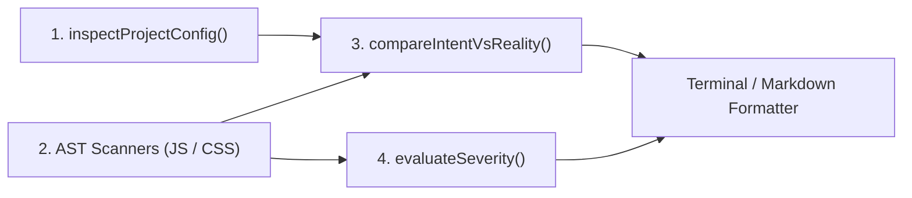

# compat-audit

> Zero-config browser compatibility engine and AI agent skill scaffolder for compiled production bundles in single-page apps and monorepos.

[](LICENSE)
[](https://nodejs.org/)
[](https://www.npmjs.com/package/compat-audit)

---

## Overview

Static linters inspect source files before compilation, missing runtime realities:
- Modern bundlers transpile syntax (classes, arrow functions) but do not polyfill runtime global APIs (`structuredClone`, `Array.prototype.at`, `crypto.randomUUID`, `ResizeObserver`).
- Third-party packages in `node_modules` inject untranspiled CSS (`&` nesting, `oklch()`, `@container`) and modern syntax leaks directly into production chunks.
- Monorepo packages frequently bypass application-level Vite, Babel, or SWC downleveling configurations.

`compat-audit` parses the AST of compiled production bundles (`dist/`, `build/`, `.output/`) and evaluates features against MDN Browser Compatibility Data and Can I Use statistics across key Desktop and Mobile engines (Chrome, Safari, Firefox, Edge, iOS Safari, Chrome Android, Samsung Internet).

It computes exact browser support floors, isolates guarded code, traces vendor package leaks via source maps, detects Safari and WebKit rendering traps, quantifies market coverage drift against declared targets, and outputs severity-classified compatibility issues.

---

## Quickstart

### 1. Direct CLI Audit

Run directly against your project or monorepo workspace:

```bash
# Auto-detects dist/ and scans production assets
npx compat-audit

# Force a clean build before scanning to guarantee fresh assets
npx compat-audit --build

# Specify audience region (default: global)
npx compat-audit --region FR

# Audit a specific project within a monorepo workspace
npx compat-audit --project apps/web
```

### 2. Scaffold AI Agent Skills

Install skills for AI coding assistants (Claude Code, Google Antigravity, Cursor, Windsurf, Codex, Copilot):

```bash
npx compat-audit --init-skills
```

Supports project-level (`.agents/skills/`) and global (`~/.agents/skills/`) installations.

---

## Key Features

- **Semantic AST Lexical Scope Tracking**: Acorn AST traversal resolves variable scopes and function parameters to prevent false positive collisions between local identifiers and global Web APIs.
- **Intelligent Guard & Polyfill Detection**: Code protected by runtime guards (`typeof Window !== 'undefined'`, `'at' in Array.prototype`, `try-catch`) is recognized and excluded from compatibility gaps.
- **Monorepo & Workspace Autodetection**: Automatically discovers workspace boundaries (`pnpm-workspace.yaml`, `workspace.yml`, npm/yarn/bun `workspaces`, `lerna.json`), generates top-level summary tables, and outputs dedicated reports per sub-project.
- **Parametric Audience Coverage**: Dynamic region support (`--region <code>`, e.g. `global`, `FR`, `US`, `DE`) computes both declared *Target Coverage* and actual *Measured Coverage* to measure real audience drift.
- **Safari & WebKit Trap Detection**: Flags missing `-webkit-` prefixes (`backdrop-filter`, `line-clamp`, `appearance`), 100vh viewport bugs without dynamic viewport unit (`100dvh`) fallbacks, and flexbox overflow traps.

---

## How the Engine Works

`compat-audit` operates strictly offline with zero external network requests or AI inference during analysis:



1. **Configuration Inspection (`inspectProjectConfig`)**: Parses config files (`vite.config.*`, `tsconfig.json`, `postcss.config.*`, `.browserslistrc`) to extract declared intent (`target: 'es2020'` or PostCSS plugins).
2. **AST Scanning (`JsScanner` & `CssScanner`)**: Parses compiled assets with Acorn and css-tree. Resolves scopes, detects unguarded Web APIs, inspects CSS selectors/properties, and correlates `.map` source maps with originating vendor packages.
3. **Intent vs Reality Cross-Referencing (`compareIntentVsReality`)**: Evaluates declared compiler targets against actual bundle contents to identify configuration drift.
4. **Severity Evaluation (`evaluateSeverity`)**: Classifies compatibility issues into a 4-tier CI/Sec severity scale (`BLOCKING`, `HIGH`, `MEDIUM`, `LOW`).

---

## Monorepo & Workspaces

Running `compat-audit` at the root of a workspace automatically discovers configured projects:
- `pnpm-workspace.yaml` / `pnpm-workspace.yml`
- `workspace.yml` / `workspace.yaml`
- `"workspaces"` field in `package.json` (npm, Yarn, Bun)
- `lerna.json`

The generated report contains:
1. **Monorepo Summary Table**: Overview of all sub-projects with declared targets, measured floors, audience coverage, and compliance verdicts.
2. **Individual Project Reports**: Full diagnostics, browser headroom breakdown, and severity-classified compatibility issues per project.

To audit only a single package within the workspace:
```bash
npx compat-audit --project @scope/web
```

---

## CI/Sec Severity Scale (BLOCKING, HIGH, MEDIUM, LOW)

Detected compatibility issues are categorized by execution impact:

| Severity | Impact / Error Type | Examples | Browser Behavior |
|---|---|---|---|
| **BLOCKING** | SyntaxError / TypeError | Untranspiled syntax, `Array.prototype.at()` | Fatal script parse/runtime crash |
| **HIGH** | ReferenceError | `structuredClone()`, `crypto.randomUUID()` | Crash when invoked |
| **MEDIUM** | Ignored CSS (Layout) | `:has()`, `@container`, `light-dark()` | Silent layout/visual degradation |
| **LOW** | Visual Glitch / Prefix | `-webkit-backdrop-filter`, `100vh` without `100dvh` | Minor cosmetic issue |

Remediation and zero-bloat optimizations (zero-dependency runtime shims, bundler downleveling, CSS fallbacks) are handled interactively via the `/compat-optimize` agent skill.

---

## CLI Reference

```bash
compat-audit [dir] [options]
```

### Options

| Option | Type | Default | Description |
|---|---|---|---|
| `[dir]` | `string` | auto-detected | Target directory containing compiled assets (`dist`, `.output/public`, etc.). |
| `--build` | `boolean` | `false` | Force a fresh production build before auditing. |
| `--all` | `boolean` | `false` | Display all detected issues (default: only issues causing compatibility gaps). |
| `--project, -p <name>` | `string` | - | Filter audit to a specific project in a monorepo workspace. |
| `--region, -r <code>` | `string` | `global` | Audience region for market share coverage (e.g. `global`, `FR`, `US`). |
| `--format <type>` | `string` | `terminal` | Output format: `terminal` (default), `json`, `markdown`. |
| `--json` | `boolean` | `false` | Shorthand for `--format json`. |
| `--markdown`, `--md` | `boolean` | `false` | Shorthand for `--format markdown`. |
| `--ci`, `--fail-on-gap` | `boolean` | `false` | Exit with code 1 if compatibility gaps are detected (CI mode). |
| `init`, `--init-skills` | command | - | Scaffold AI agent skills interactively. |
| `--local`, `-l` | `boolean` | `true` | Install skills to project workspace (`.agents/skills/`). |
| `--global`, `-g` | `boolean` | `false` | Install skills globally to user home directories. |
| `-h`, `--help` | - | - | Display help menu. |
| `-v`, `--version` | - | - | Display current version. |

### CI / PR Verification Example

Prevent compatibility regressions in GitHub Actions:

```yaml
- name: Audit Browser Compatibility
  run: npx compat-audit --build --ci --markdown >> $GITHUB_STEP_SUMMARY
```

---

## AI Agent Integration

`compat-audit init` registers agent skills for AI assistants:

- **`/compat-audit`**: Runs bundle audits, checks declared targets, and outputs cross-browser support tables.
- **`/compat-optimize`**: Interactively applies targeted fixes (progressive enhancement fallbacks, inline runtime polyfills, bundler/PostCSS configuration) and validates fixes with post-fix audits.

---

## Programmatic API

```javascript
import { auditBundle, initSkills } from 'compat-audit';

// Audit bundle programmatically
const report = await auditBundle({
  dir: 'dist',
  region: 'global', // or 'FR', 'US', etc.
  build: true,
  cwd: process.cwd()
});

console.log(report.verdict); // 'COMPLIANT' | 'COMPATIBILITY GAP DETECTED'
console.log(report.measuredCoverage); // e.g. 98.5

// Scaffold agent skills programmatically
initSkills({ cwd: process.cwd(), global: false });
```

---

## License

- Source code licensed under the [MIT License](LICENSE).
- Compatibility dataset from [@mdn/browser-compat-data](https://github.com/mdn/browser-compat-data) (CC0 1.0 Universal).
- Browser usage statistics from [caniuse-lite](https://github.com/browserslist/caniuse-lite) (CC-BY-4.0).
- See [LICENSE-THIRD-PARTY.md](LICENSE-THIRD-PARTY.md) for attribution.
